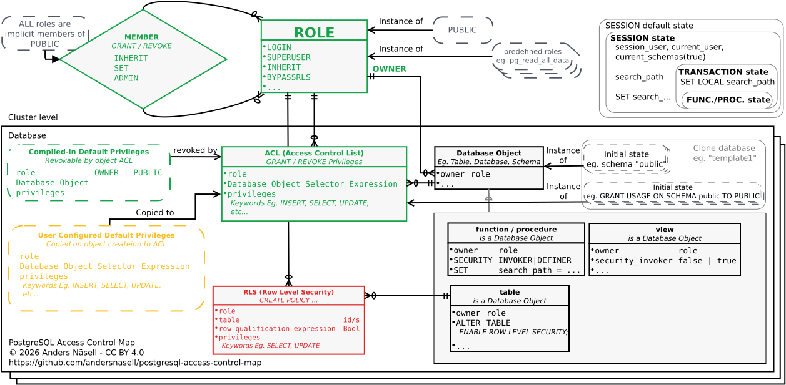

# PostgreSQL Access Control Map

A <b>visual map</b> of the PostgreSQL access control model for reasoning <b>systematically</b> about roles, privileges, ownership and other authorization mechanisms.

PostgreSQL provides several mechanisms that determine whether a role is allowed to perform an operation. Looking at these mechanisms individually can make it difficult to reason about the complete access configuration.

This map brings the mechanisms together in one view, with the goal of making PostgreSQL access control easier to reason about systematically.

The map was developed for the talk **“PostgreSQL Access Control as a Map – Reasoning About Privileges Visually”**, first presented at the Malmö PostgreSQL User Group (M-PUG) in September 2026.

## The map

The SVG version is the primary version for viewing and sharing.

A PDF version is also provided for convenient viewing and printing.

The original Dia source file is included in the `source` directory.

## License

This work is licensed under the Creative Commons Attribution 4.0 International License (CC BY 4.0).

You are free to share and adapt the map, including for commercial purposes, provided that appropriate attribution is given.

Suggested attribution:

> PostgreSQL Access Control Map by Anders Nåsell, licensed under CC BY 4.0.

When sharing an adapted version, please indicate that changes have been made.

## About the talk

**PostgreSQL Access Control as a Map – Reasoning About Privileges Visually**

The talk uses the map to explore PostgreSQL access control as a complete model rather than as a collection of individual SQL commands and privileges. The goal is to make it easier to reason about where access can be granted and where unintended access might arise.
